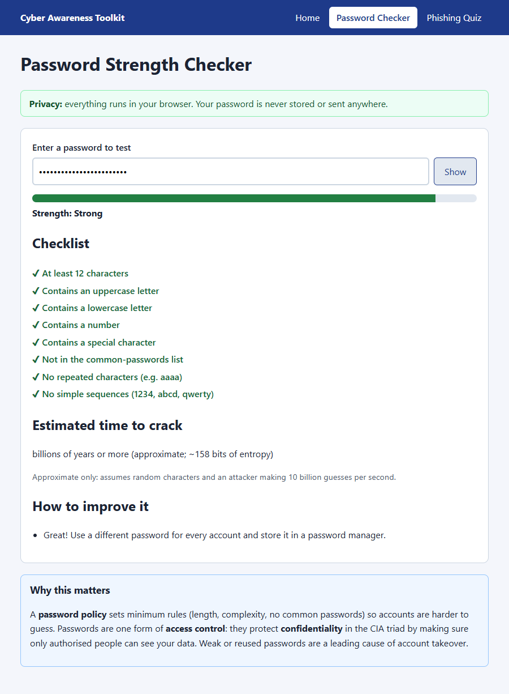
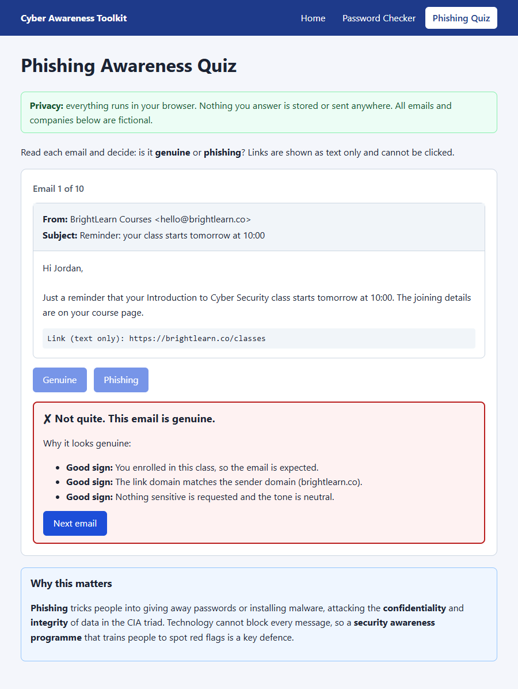

# Password Strength & Phishing Awareness Checker

A beginner-level cybersecurity project built with plain HTML, CSS and vanilla JavaScript. It has two tools: a **password strength checker** that rates a password live and explains how to improve it, and a **phishing awareness quiz** that trains you to spot red flags in ten fictional emails. It applies ideas from an introductory cyber security course: the CIA triad, password and access-control policies, common attacks such as phishing, and security awareness programmes. No frameworks, no backend, no build step.

**Live demo:** https://shreyatiwari18.github.io/Password-Strength-Phishing-Awareness-Checker/

## Features

**Password Strength Checker**
- Show/hide toggle and a live Weak / Medium / Strong colour meter
- ✔/✘ checklist: length ≥ 12, uppercase, lowercase, number, special character, not in a ~1,000-entry common-password list, no repeated characters, no simple sequences (1234, abcd, qwerty)
- Approximate crack-time estimate based on entropy (clearly labelled as an estimate)
- Up to three specific suggestions for improvement
- "Why this matters" box linking to password policy and access control

**Phishing Awareness Quiz**
- 10 fictional emails (5 phishing, 5 genuine) with fake company names and domains only
- Shows sender, address, subject, body and any link or attachment (links are text only, never clickable)
- Instant feedback highlighting the red flags (fake domain, urgency, OTP/password request, spelling errors, mismatched link, unexpected attachment)
- Score screen with a summary of common phishing signs, a note on the signs you missed most, a Restart button, and shuffled order every time

**General:** responsive layout, consistent navigation, labelled inputs, high-contrast colours and keyboard-friendly controls.

## Screenshots

| Password checker | Phishing quiz |
| --- | --- |
|  |  |

More images are in the [screenshots](screenshots/) folder.

## How to run

**Locally:** download or clone the repository and open `index.html` in any modern browser. Nothing needs to be installed.

```
git clone https://github.com/ShreyaTiwari18/Password-Strength-Phishing-Awareness-Checker.git
cd Password-Strength-Phishing-Awareness-Checker
# then open index.html
```

**GitHub Pages:** https://shreyatiwari18.github.io/Password-Strength-Phishing-Awareness-Checker/

**Tests (optional, needs Node.js 18+):**

```
node --test tests/password.test.js tests/phishing.test.js
# browser check: npm install --no-save playwright && npx playwright install chromium
node tests/browser-check.js
```

## Concepts applied

| Course topic | Where it appears |
| --- | --- |
| **CIA triad - Confidentiality** | Strong passwords stop unauthorised people reading your data; phishing is an attack on confidentiality |
| **CIA triad - Integrity** | Malware and account takeover (via phishing) can alter data; the quiz teaches how to avoid them |
| **Password policy** | The checklist mirrors a real policy: minimum length, complexity, banned common passwords, no patterns |
| **Access control** | Passwords are an authentication factor that decides who gets access; the tool explains why they matter |
| **Common attacks** | Dictionary attacks (common-password list), brute force (entropy and crack time), phishing and malware attachments |
| **Security awareness programmes** | The quiz is a small awareness-training exercise with immediate feedback |
| **Risk assessment** | See the risk table in [docs/report.md](docs/report.md) |

## Privacy

Everything runs in your browser. Passwords and quiz answers are never stored, logged or sent anywhere. There are no external API calls, cookies or analytics.

## Assumptions

- **Repository name:** the code is hosted at the repository URL provided (`Password-Strength-Phishing-Awareness-Checker`) instead of a new repo called `password-phishing-checker`.
- **Common passwords:** the list has about 1,000 entries compiled from well-known weak passwords and simple variations; it is a sample, not a full breach database.
- **Crack time:** assumes 10 billion guesses per second, random characters and no knowledge of patterns. Real-world results vary.
- **"Repeated characters"** means 3 or more identical characters in a row; **"sequence"** means 4 consecutive letters or digits (ascending or descending) or a common keyboard pattern.
- **Strength rating:** Weak = common password, under 40 bits of entropy, or half or more of the checks failed; Strong = all 8 checks pass; otherwise Medium.
- **Pushing:** the GitHub CLI (`gh`) was not available, so the code is pushed with plain `git`.

## Tests performed

See [docs/report.md](docs/report.md#testing) for the list of test cases.

## Licence

MIT - see [LICENSE](LICENSE).
